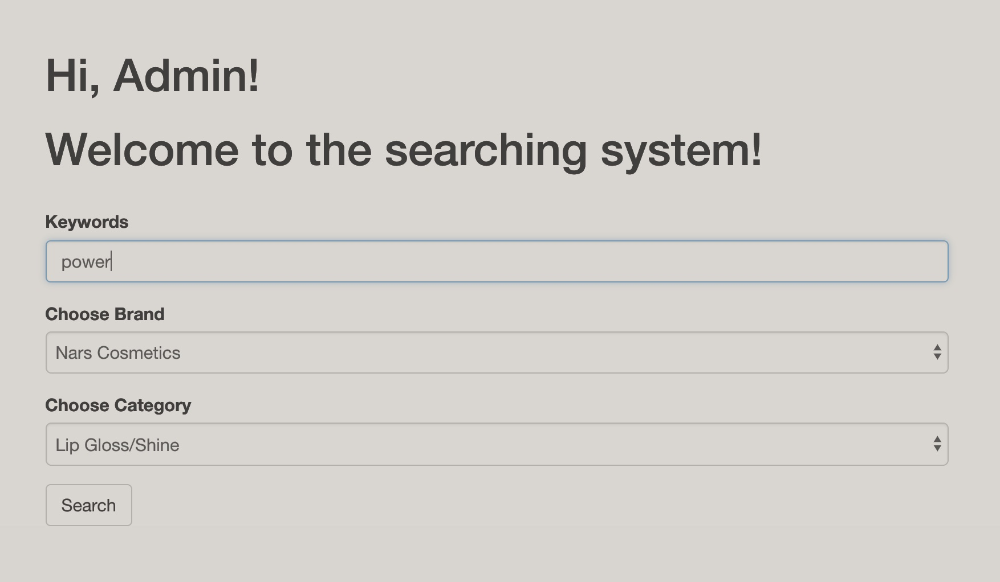
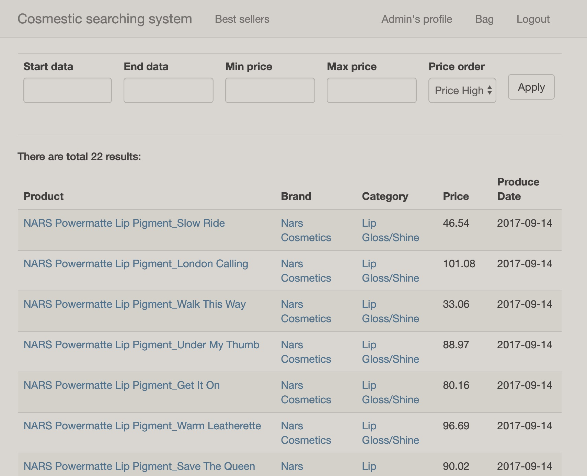
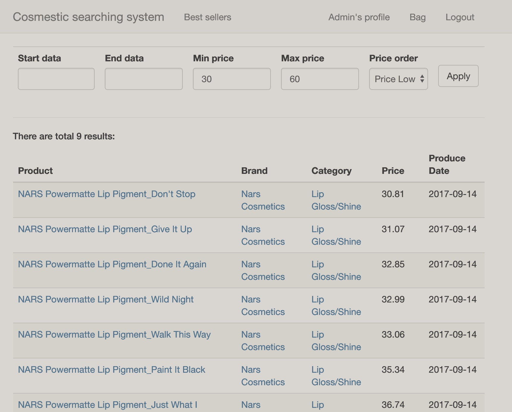
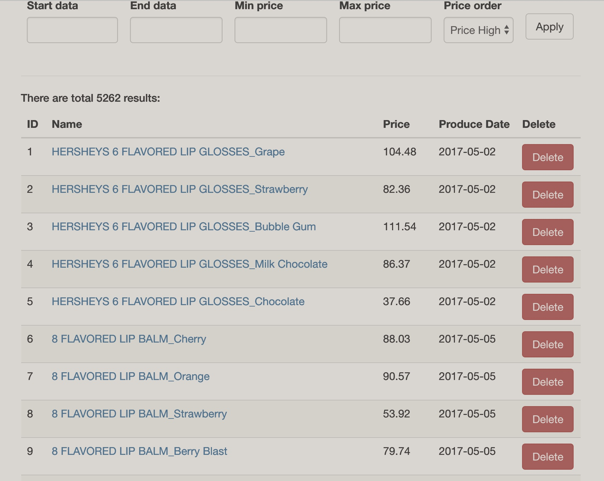
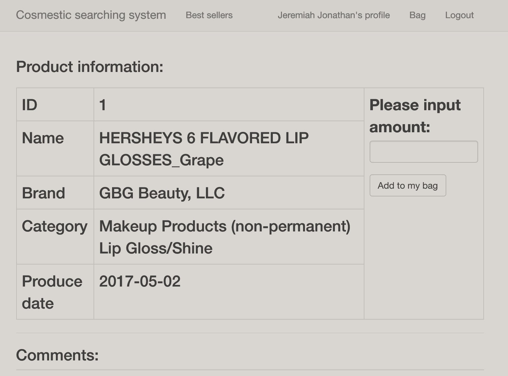
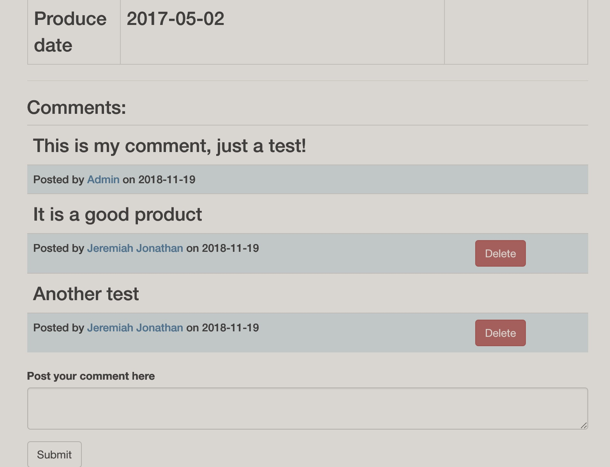
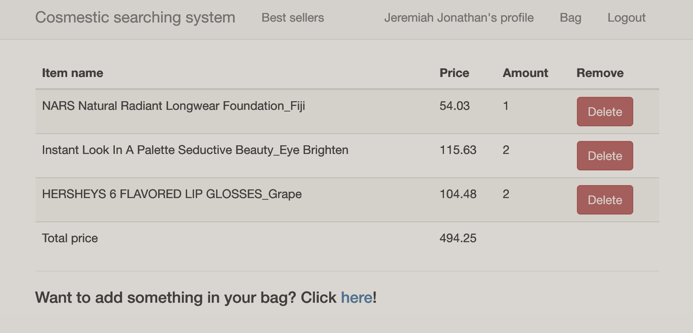

# Cosmetics information searching system

#### A course project of Columbia University, COMS 4111 Intro to Database

##### Team members: Penghe Zhang (pz2244); Ruochen You (ry2349)

### How to start?

+ The account of the PostgreSQL is `pz2244`;
+ The whole project is based on __Python3__;
+ Enter in the root directory of the project, run `sudo pip3 install -r requirements.txt` to install all the packages needed for the project;
+ Run `flask run --host 0.0.0.0 --port 8111` to start the service.

#### The PostgreSQL account

`pz2244`

#### The url of the web application

> http://35.196.3.71:8111/

#### Comparison with Part 1

##### Implemented parts:

1. `customers` : 

   The user who uses the system can register as a member of the system by typing in their name, birthday, gender, password. Remember the user need to type a different name from all the names in database, if you type a same name, the system will notify the user to change your name. After registering, you can enter the profile page to view your information. Moreover, the system will remember you login status even the system shut down.

2. `brands`:

   We also implemented the `brands` part in our system, you can search specific brand's products from our system.

3. `categories`:

   Nearly have the same function as `brands`, you can regard `categories` as a key factor during searching product.

4. `products`:

   The main part of the system, we contain nearly 5000 rows in the system. You can search keyword of the product to target certain products. Then you can find a product's detail information in the detail page, such as price, produce date. Also, you can find the brands, categories of the products, which links with the `brands` and `categories` parts.

5. `bags`:

   This is the part you can put some products in. You can choose the amount of certain product you want to put in your bag in the product detail information page. And we will count a total sum of your bag.

6. `communities`:

   In the product detail page, you can also post your comment on the product, the system will record your comment with the current time. You can post more than one comments to one product, but you cannot post a totally same comment to the product.

7. `bestsellers`:

   This part contains the bestsellers of a specific date, you can choose a specific date to see the bestsellers of that day. That means there can be same products in different date, but in the same date same product cannot appear twice.

##### Unimplemented parts:

__NONE__

##### New Features:

1. Add `auto_increment` to the primary keys of  `customers` and `comments` ;
2. Add `primary category` and `sub category`in the `categories`;
3. Add `defalut time now` to the `posttime` attribute of `comments`;
4. Add an `Admin` in the system which can manipulate overall database of the system in a visulization way. 

#### Description of web pages

1. __The search and filter page__

You can see from the web page, you can enter the keyword, and choose brand/category to filter certain products. After tapping `Search button` you will get your results:

In the result you can choose all what you want and enter the detail page (All the text blue represent it is a hyper link). Also you can see there is a filter on the top of the page, you can type in your specific constraints (eg. start date, end date, min price, max price, order) to filter your wished result:

All these operations are implemented by combing the three tables (`products`, `brands`, `categories`) together to get all information of products and then use `where` to filter and use `order by` to order all the products. And we also use `count` to get the total number of the products. If you are an `admin`, you will also have the authority to modify and delete product:

2. __The detail page of product__

You can see from the page is divided into two parts: the information part and the comments part.

In the information part, you can see all the information about the product, including: ID, name, brand, category and its produce date. Also, you can choose how many products you can add into your bag. If you have already added it in your add, new amount will add together with the old ones:

On the other hand, you can add your comment in the page, and it will be displayed in the end of the page. You can also delete your own comment by yourself, but you cannot delete others' comments (only if you are Admin). 

The add-comment operation is based on `insert` and also detect whether it is a validate comment, also delete-comment is based on `delete`.

The add-to-bag operation is basically based on `insert` and `update`, we first detect whether there is a same (`pid`, `cid`) in the `bags` table, and then use `insert` and `update` to update your bag. Moreover, we get the total price by joining `bags` and `products`, find all the rows with a same `cid`, then sum to get the total price.

